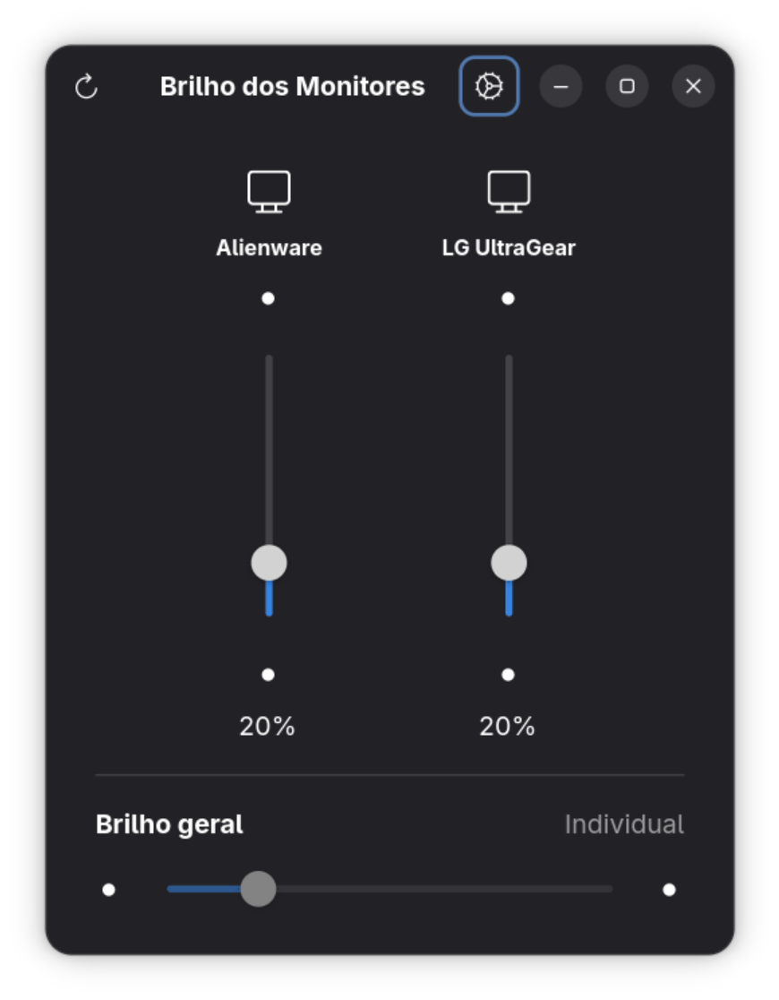

# GnomeBrightness

A native GTK4 / libadwaita app to control the brightness of external monitors over DDC/CI, built for GNOME.

Drag one slider per monitor, or use the "Overall brightness" slider to move every monitor together. Monitors are detected dynamically (no hardcoded list), and displays that don't support DDC/CI brightness control are shown disabled instead of being hidden. A system tray icon with quick presets lets you adjust brightness without opening the window.

## Screenshot



## Features

- Per-monitor and overall brightness sliders, following the GNOME/Adwaita visual language
- Dynamic monitor detection via `ddcutil` — plug in a new monitor and hit refresh
- Monitors without DDC/CI support are shown (disabled) rather than silently dropped
- Tray icon (StatusNotifierItem) with a "Presets" submenu (0/25/50/75/100%), show/hide, detect, quit, and a "Preferences" shortcut
- Preferences window (gear icon in the header bar):
  - Theme: System / Light / Dark
  - Launch at login (writes/removes the autostart entry for you, no reinstall needed)
  - Start minimized in tray
  - Custom per-monitor display names — purely cosmetic, only shown inside the app, keyed by EDID so they survive replugging/renumbering
- Window size persisted across restarts
- Localized: Brazilian Portuguese and English (US)

## Technologies

- **[Rust](https://www.rust-lang.org/)** (2021 edition)
- **[gtk4-rs](https://gtk-rs.org/)** / **[libadwaita-rs](https://gtk-rs.org/gtk4-rs/stable/latest/docs/libadwaita/)** — UI toolkit
- **[ksni](https://crates.io/crates/ksni)** — pure-Rust StatusNotifierItem (tray icon) implementation
- **[ddcutil](https://www.ddcutil.com/)** (external CLI dependency) — talks DDC/CI to monitors over I2C
- **[gettext-rs](https://crates.io/crates/gettext-rs)** — i18n, standard GNOME localization workflow (`.po`/`.mo`)
- **[serde](https://serde.rs/)** + **[toml](https://crates.io/crates/toml)** — config persistence
- **[directories](https://crates.io/crates/directories)** — XDG-compliant config path resolution
- **[tokio](https://tokio.rs/)** + **[async-channel](https://crates.io/crates/async-channel)** — async runtime for the tray, glued to the GLib main loop

## Requirements

- GNOME Shell (developed against GNOME 50 / GTK 4.22 / libadwaita 1.9, but should work on recent GNOME 4x versions too)
- [`ddcutil`](https://www.ddcutil.com/) installed and able to talk to your monitors without `sudo` (you typically need to be in the `i2c` group — see the [ddcutil user guide](https://www.ddcutil.com/config/))
- For the tray icon to appear: a StatusNotifierItem host. GNOME Shell doesn't ship one out of the box — install the [AppIndicator and KStatusNotifierItem Support](https://extensions.gnome.org/extension/615/appindicator-support/) extension.

## Building

```sh
cargo build --release
```

The binary is produced at `target/release/gnome-brightness`.

### Build-time dependencies

You'll need the GTK4 and libadwaita development headers (via `pkg-config`), e.g. on Arch:

```sh
sudo pacman -S gtk4 libadwaita
```

## Installing (local, non-packaged)

```sh
./install.sh
```

This builds a release binary and installs it locally, without touching the system:

- Binary → `~/.local/bin/gnome-brightness`
- Desktop entry → `~/.local/share/applications/io.github.weversonl.GnomeBrightness.desktop` (shows up in the GNOME app launcher)
- Icon → `~/.local/share/icons/hicolor/scalable/apps/`
- Translations → `~/.local/share/locale/{pt_BR,en_US}/LC_MESSAGES/gnome-brightness.mo`

Autostart is not set up by the installer — enable it from within the app instead (Preferences → "Launch at login").

Make sure `~/.local/bin` is on your `PATH`.

## Running

After installing, launch **GnomeBrightness** from the GNOME app launcher, or run:

```sh
gnome-brightness
```

Closing the window hides it to the tray instead of quitting — use the tray menu's "Quit" to actually exit.

Without installing, you can also run it directly from the build:

```sh
cargo run --release
```

(`build.rs` compiles `po/*.po` into `po/locale/` on every build, so translations work in this mode too — no need to run `install.sh` first)

## Configuration

Everything is editable from the in-app Preferences window (gear icon in the header bar): theme, launch-at-login, start-minimized, and per-monitor custom names.

Under the hood, settings are stored in `~/.config/gnome-brightness/config.toml`: theme override, monitor nicknames (keyed by EDID, so they survive replugging even if `ddcutil`'s display numbering shifts), start-minimized flag, and window size. Autostart itself isn't tracked in this file — its source of truth is whether `~/.config/autostart/io.github.weversonl.GnomeBrightness.desktop` exists, which the Preferences switch manages for you.

## Project structure

```
src/
├── main.rs         # App bootstrap, i18n init, tray event wiring
├── window.rs       # AdwApplicationWindow, sliders, overall/individual sync logic
├── preferences.rs  # Preferences window (theme, autostart, start-minimized, monitor names)
├── autostart.rs    # Reads/writes the ~/.config/autostart/ desktop entry
├── tray.rs         # StatusNotifierItem tray (ksni)
├── ddc.rs          # ddcutil subprocess integration (detect/get/set brightness)
├── monitor.rs      # Monitor model
└── config.rs       # TOML-backed settings persistence
assets/             # Screenshots used in this README
data/               # .desktop entry template and app icon
po/                 # gettext translation files (pt_BR, en_US)
docs/               # technical documentation (architecture, where to change what)
install.sh          # Local (non-packaged) build + install script
```

See `docs/OVERVIEW.md` for a quick map of the codebase, or `docs/ARCHITECTURE.md` for the full technical write-up.

## Localization

UI strings are wrapped with `gettext()`; source strings are in English, with `po/pt_BR.po` providing the Brazilian Portuguese translation. The language is picked up from your system locale (`LANG`/`LC_MESSAGES`) — there's no in-app language switcher.
